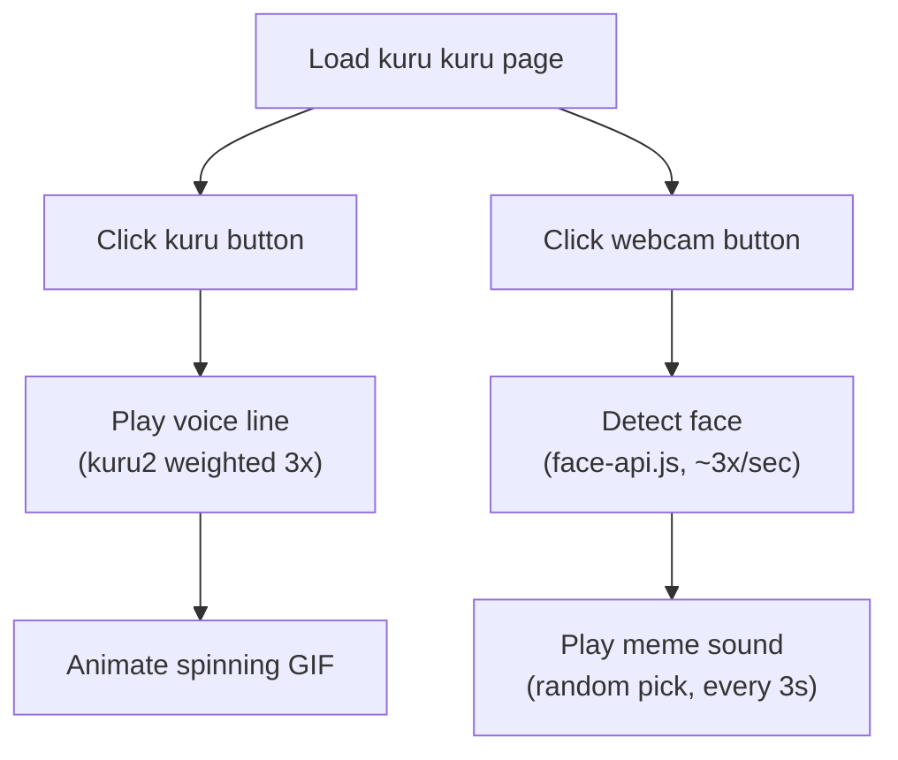

# [kuru kuru] 🎯

## Basic Details
### Dashamulan damu: [Name]

### Team Members
- Team Lead: [Rithuraj P V] - [College of engneering trikaripur]
- Member 2: [Athul krishana A ] - [College of engneering trikaripur]

### Project Description
its just a website were you click a button and a character from a game honkai star rail spin around with a funny scream.and also it has a webcam mode which roasts you for just existing
### The Problem (that doesn't exist)
problem of self obsession

### The Solution (that nobody asked for)
this thing will roast you for too self obsessive ,and the other is just a simple satisfying sound.
## Technical Details
### Technologies/Components Used
For Software:
- Language: Vanilla JavaScript (ES6), HTML5, CSS3 — no TypeScript.

Framework: None. No build step, no bundler (no React/Vue/etc.) — plain static site.
- Libraries:

face-api.js (v0.22.2, via CDN) — TensorFlow.js-based face detection (TinyFaceDetector model)
mdui (v1.0.2, via CDN) — Material Design UI component/styling library

- Browser APIs used directly (no library needed):

getUserMedia — webcam access
Canvas API — drawing face bounding boxes
Audio / HTML5 audio playback
localStorage — persisting the click counter

### Project Documentation
For Software:

# Screenshots (Add at least 3)
[https://drive.google.com/drive/folders/1OVDLa27gHLUJOz8ypZWr2E7kA_cgOx_O?usp=drive_link]
# Diagrams
![## Architecture / Workflow

*The app has two independent workflows triggered from the same page. Clicking the kuru button plays a weighted-random Japanese voice line — "kuru2" ("kuru kuru") is 3x more likely to play than "kuru1" ("kururin") or "kuruto" — and animates the spinning GIF across the screen. Clicking the webcam button opens the camera and runs face-api.js's TinyFaceDetector in a loop (~3 scans/second); as soon as a face is detected, a random meme sound plays from a pool of three clips, repeating every 3 seconds while the face stays in frame. All detection runs client-side in the browser — no video or image data ever leaves the user's machine.*]

### Project Demo
# Video
[https://drive.google.com/drive/folders/1OVDLa27gHLUJOz8ypZWr2E7kA_cgOx_O?usp=drive_link]

# Additional Demos
[Add any extra demo materials/links]

## Team Contributions
- [Athul krishna A]: [idea,ui]
- [Rithuraj P V]: [laptop,idea]

---
Made with ❤️ at TinkerHub Useless Projects 

